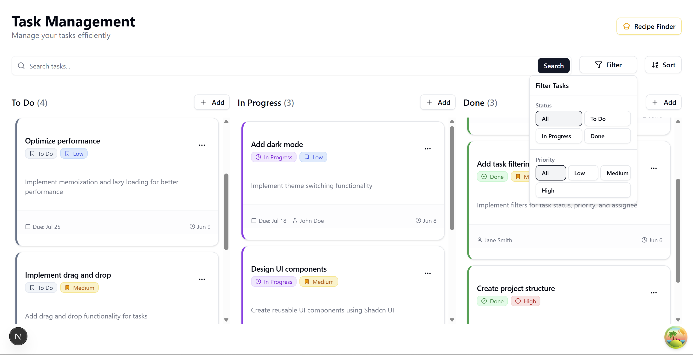

# Task Management Application

A modern, responsive Task Management application built with Next.js 15, TypeScript, Tailwind CSS, Shadcn UI, Zustand, and other modern web technologies. This project demonstrates best practices for building a modern React application with a clean, maintainable codebase.



## Live Demo

[View Live Demo]()

## Features

- ✅ Full CRUD operations for tasks (Create, Read, Update, Delete)
- ✅ Task organization with status columns (To Do, In Progress, Done)
- ✅ Advanced filtering and sorting capabilities
- ✅ Modern, responsive UI with Tailwind CSS and Shadcn UI
- ✅ Form validation with Zod and React Hook Form
- ✅ State management with Zustand
- ✅ API integration with Tanstack Query (Recipe Finder feature)
- ✅ Confirmation dialogs for destructive actions
- ✅ Accessibility features
- ✅ Toast notifications for user actions

## Tech Stack

- **Framework**: Next.js 15 (App Router)
- **Language**: TypeScript
- **Styling**: Tailwind CSS
- **UI Components**: Shadcn UI (built on Radix UI)
- **State Management**: Zustand
- **Form Handling**: React Hook Form with Zod validation
- **Data Fetching**: Tanstack React Query
- **Utilities**: date-fns for date formatting, uuid for ID generation
- **Animations**: CSS transitions and keyframe animations

## Project Structure

```
task-management/
├── src/
│   ├── app/                    # Next.js App Router pages
│   │   ├── recipes/            # Recipe Finder feature
│   │   ├── globals.css         # Global styles
│   │   ├── layout.tsx          # Root layout
│   │   └── page.tsx            # Home page
│   ├── components/             # UI components
│   │   ├── task/               # Task-specific components
│   │   ├── recipe/             # Recipe-specific components
│   │   └── ui/                 # Shadcn UI components
│   ├── hooks/                  # Custom React hooks
│   ├── lib/                    # Utility functions
│   │   ├── api/                # API functions
│   │   └── providers/          # React providers
│   ├── store/                  # Zustand stores
│   ├── types/                  # TypeScript type definitions
│   └── validators/             # Zod validation schemas
└── public/                     # Static assets
```

## Code Walkthrough

### State Management

This project uses Zustand for state management, which provides a simple yet powerful way to manage application state. The main stores are:

- **`task-store.ts`**: Manages tasks with CRUD operations, filtering, and sorting.
- **`recipe-store.ts`**: Manages recipe search and favorites for the Recipe Finder feature.

```typescript
// Example of the task store
export const useTaskStore = create<TaskStore>((set, get) => ({
  tasks: initialTasks,
  filter: {},
  sort: { option: 'createdAt', direction: 'desc' },
  
  // CRUD Operations
  addTask: (task) => {
    const newTask: Task = {
      ...task,
      id: uuidv4(),
      createdAt: new Date(),
      updatedAt: new Date(),
    };
    
    set((state) => ({
      tasks: [...state.tasks, newTask]
    }));
  },
  // ... other methods
}));
```

### Component Organization

Components are organized by feature and responsibility:

- **Task Components**: Handle task management UI (cards, board, actions, forms)
- **Recipe Components**: Handle the Recipe Finder feature
- **UI Components**: Reusable UI components from Shadcn UI

### Design Decisions

#### 1. Shadcn UI + Tailwind CSS

We chose Shadcn UI with Tailwind CSS for several reasons:

- **Customizability**: Provides a great foundation while allowing for extensive customization
- **Accessibility**: Built on Radix UI primitives, ensuring good accessibility
- **Component Ownership**: Components are directly in our codebase, not external dependencies
- **Styling Flexibility**: Tailwind enables consistent, responsive designs with minimal CSS

#### 2. Zustand for State Management

Zustand was chosen over other state management solutions because:

- **Simplicity**: Simple API with minimal boilerplate
- **TypeScript Support**: Excellent TypeScript integration
- **Performance**: Minimal re-renders with fine-grained control
- **Middleware Support**: Supports middleware for persistence, devtools, etc.

#### 3. Tanstack Query for Data Fetching

Tanstack Query handles API interactions in the Recipe Finder feature:

- **Caching**: Built-in caching reduces unnecessary network requests
- **Loading/Error States**: Simplified handling of async states
- **Refetching**: Automatic refetching and background updates
- **Devtools**: Great debugging tools

#### 4. Confirmation Dialogs

We implemented confirmation dialogs for destructive actions to prevent accidental data loss. These use Shadcn UI's AlertDialog component, which is accessible and properly handles keyboard interactions.

#### 5. Color System

The application uses a consistent color system:

- **Status Colors**:
  - To Do: Slate
  - In Progress: Purple
  - Done: Green

- **Priority Colors**:
  - Low: Blue
  - Medium: Amber
  - High: Red

This visual system helps users quickly identify task attributes.

## Accessibility Features

- **Keyboard Navigation**: All interactive elements are keyboard accessible
- **Screen Reader Support**: Proper ARIA attributes and semantic HTML
- **Focus Management**: Visible focus indicators
- **Color Contrast**: Meets WCAG standards for color contrast
- **Responsive Design**: Works on all screen sizes

## Performance Optimizations

- **Memoization**: Strategic use of memoization to prevent unnecessary re-renders
- **Code Splitting**: Components are loaded only when needed
- **Image Optimization**: Next.js Image component for optimized images
- **Font Optimization**: Next.js Font system for optimal font loading

## Getting Started

### Prerequisites

- Node.js 18+ and npm

### Installation

1. Clone the repository:
```bash
git clone https://github.com/abhi3566/task-management-recipe-next
cd task-management-recipe-next
```

2. Install dependencies:
```bash
npm install
```

3. Run the development server:
```bash
npm run dev
```

4. Open [http://localhost:3000](http://localhost:3000) in your browser.

## License

MIT License - See LICENSE file for details.
